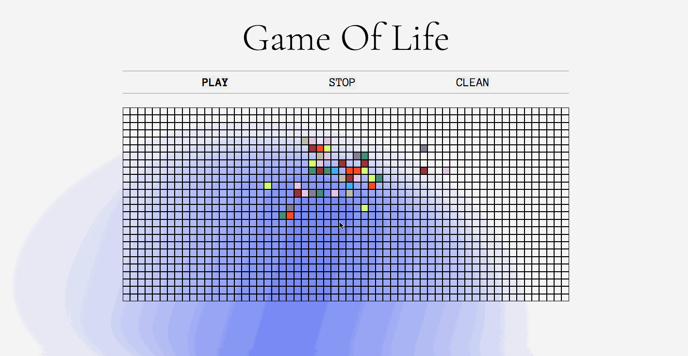

# Game Of Life

It consists of a collection of cells which, based on a few mathematical rules, can live, die or multiply.

## Rules
For a space that is populated:
- Each cell with one or no neighbors dies, as if by solitude.
- Each cell with four or more neighbors dies, as if by overpopulation.
- Each cell with two or three neighbors survives.

For a space that is empty or unpopulated
- Each cell with three neighbors becomes populated.

LINK: https://game-of-life-nuria.netlify.app ⭐️

